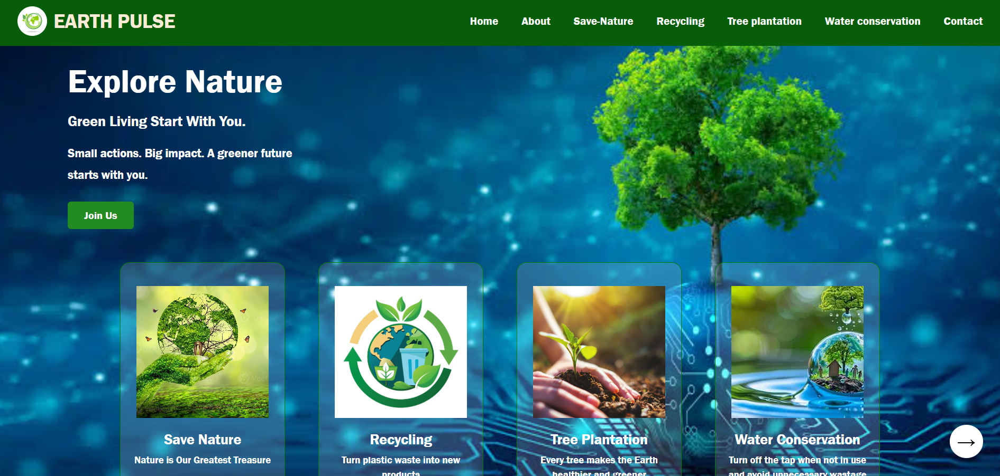
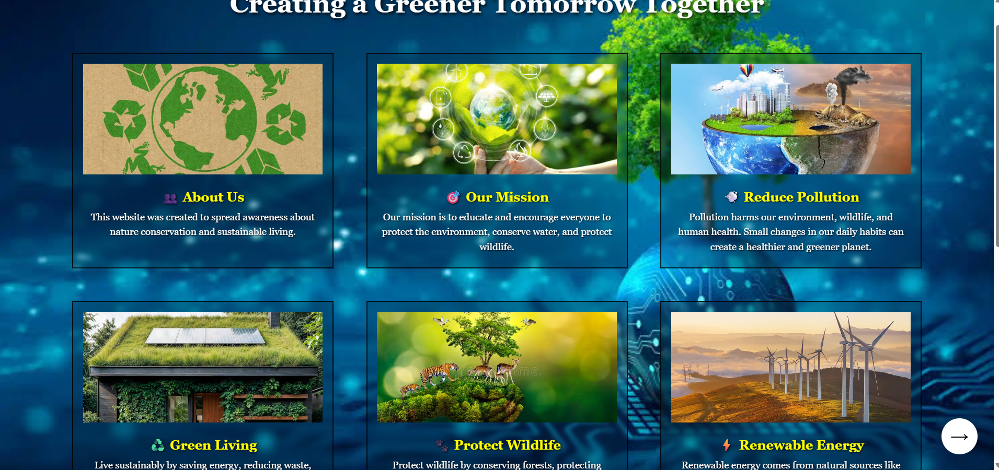
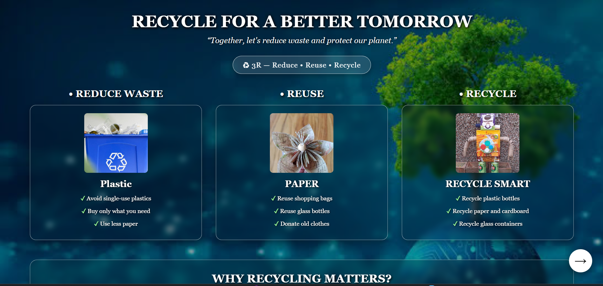
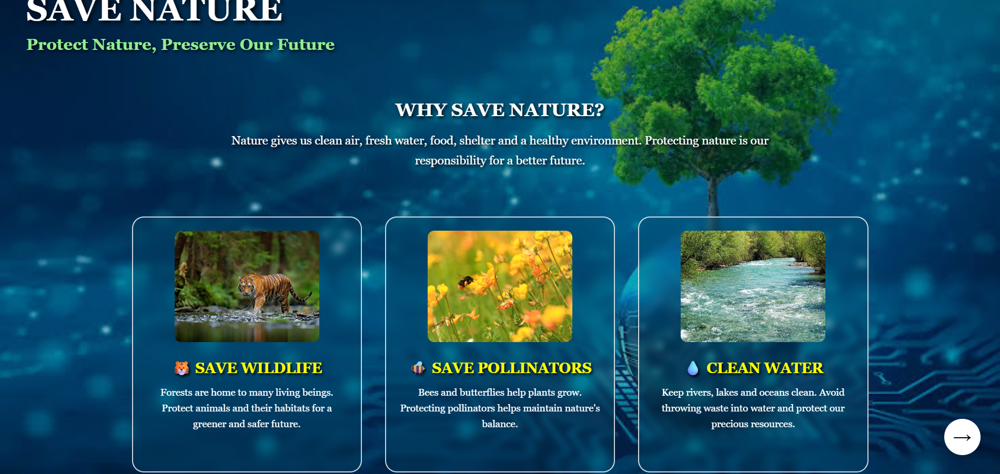
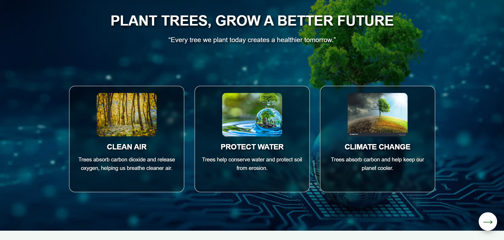
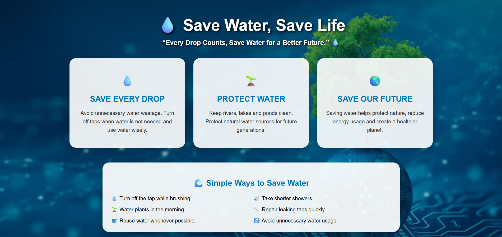
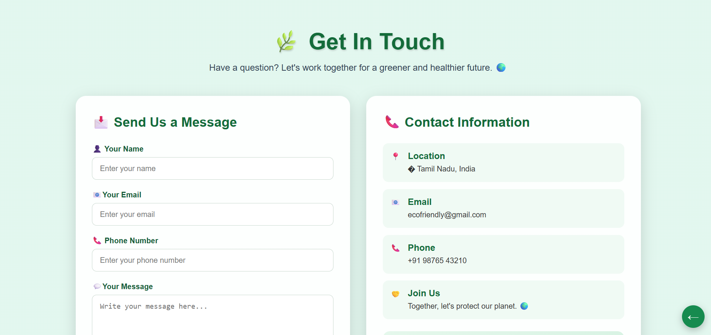

# 🌿 Eco-Friendly Awareness Website

A responsive website developed using **HTML5** and **CSS3** to create awareness about protecting nature and encouraging sustainable living. The website provides useful information about recycling, tree plantation, water conservation, biodiversity, and environmental protection through a clean and user-friendly interface.

---

## 📖 Project Overview

The **Eco-Friendly Awareness Website** is a static front-end web project designed to educate people about environmental conservation. It focuses on promoting eco-friendly habits by presenting awareness content in an attractive, responsive, and easy-to-navigate website.

This project was created as part of my web development learning using only HTML and CSS without any frameworks.

---

## 🎯 Project Objectives

* Create awareness about protecting the environment.
* Encourage people to follow eco-friendly practices.
* Explain the importance of recycling and waste management.
* Promote tree plantation and biodiversity conservation.
* Spread knowledge about saving water and natural resources.
* Design a responsive website using HTML and CSS.

---

## ✨ Features

* Responsive design for desktop and mobile devices
* Modern green-themed user interface
* Simple and clean navigation bar
* Attractive cards and nature-inspired sections
* Full-screen hero banner
* Informative environmental awareness pages
* Contact page for user interaction

---

## 📂 Website Pages

### 🏠 Home

The landing page introduces the importance of protecting nature with a beautiful hero banner and motivational content.

### 🌱 About

Explains the purpose of the website and highlights eco-friendly concepts such as reducing pollution, green living, renewable energy, and wildlife protection.

### ♻️ Recycling

Provides information about recycling, waste segregation, and the benefits of reusing materials to reduce environmental pollution.

### 🌳 Tree Plantation

Describes why planting trees is essential for clean air, climate balance, and biodiversity conservation.

### 💧 Water Conservation

Explains practical methods to save water and encourages responsible water usage in daily life.

### 📞 Contact

A simple contact page where users can submit their name, email, and message.

---

## 🛠 Technologies Used

* **HTML5** – Structure of the website
* **CSS3** – Styling and responsive design

---

## 💻 System Requirements

* Any modern web browser (Chrome, Edge, Firefox)
* Windows
* No database required
* No backend required

---
## 📸 Website Screenshots

### 🏠 Home Page

### ℹ️ About Page

### ♻️ Recycling Page

### 🌿 Save Nature Page

### 🌳 Tree Plantation Page

### 💧 Water Conservation Page

### 📞 Contact Page

## 🚀 Future Enhancements

* Add JavaScript for interactive features
* Dark/Light theme
* Environmental quiz section
* Daily eco-friendly tips
* Tree plantation counter
* User feedback storage using a database

---

## 👩‍💻 Author

**Jaya Sri**

B.Sc. Information Technology

Front-End Web Developer (HTML & CSS Project)
